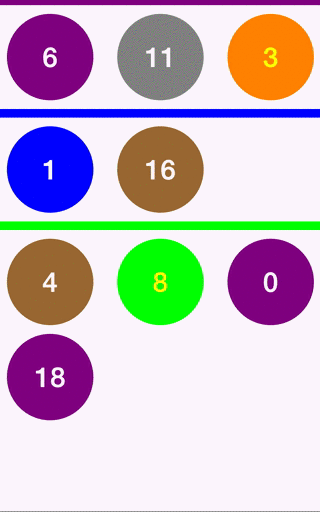

# BMACollectionBatchUpdates [](https://travis-ci.org/badoo/ios-collection-batch-updates)
`BMACollectionBatchUpdates` is a set of classes to generate updates and extensions to `UICollectionView` and `UITableView` to perform them safely in a batch manner.

<div align="center">

</div>

## How to use

In orger to generate the mentioned updates it has to make collection item and section conform the `BMAUpdatableCollectionItem` and`BMAUpdatableCollectionItem` protocols respectively:

```objectivec
@interface BMAExampleItemsSection : NSObject <BMAUpdatableCollectionSection>
@end

@interface BMAExampleItem : NSObject <BMAUpdatableCollectionItem>
@end
```

Once both old and new data models are available, it has to calculate changes and apply them:

```objectivec
@implementation BMAExampleCollectionViewController

- (void)setSections:(NSArray *)sections {
	[BMACollectionUpdate calculateUpdatesForOldModel:self.sections
                                            newModel:sections
                               sectionsPriorityOrder:nil
                                eliminatesDuplicates:YES
                                          completion:^(NSArray *sections, NSArray *updates) {
                                          		[self.collectionView bma_performBatchUpdates:updates applyChangesToModelBlock:^{
											        _sections = sections;
											    } reloadCellBlock:^(UICollectionViewCell *cell, NSIndexPath *indexPath) {
											        [self reloadCell:cell atIndexPath:indexPath];
											    } completionBlock:nil];
                                          }];
}

@end
```

```objectivec
@implementation BMAExampleTableViewController

- (void)setSections:(NSArray *)sections {
	[BMACollectionUpdate calculateUpdatesForOldModel:self.sections
                                            newModel:sections
                               sectionsPriorityOrder:nil
                                eliminatesDuplicates:YES
                                          completion:^(NSArray *sections, NSArray *updates) {
                                          		[self.collectionView bma_performBatchUpdates:updates applyChangesToModelBlock:^{
											        _sections = sections;
											    } reloadCellBlock:^(UITableViewCell *cell, NSIndexPath *indexPath) {
											        [self reloadCell:cell atIndexPath:indexPath];
											    } completionBlock:nil];
                                          }];
}

@end
```

## How to install

### Using CocoaPods

1. Include the following line in your `Podfile`:
    ```
    pod 'BMACollectionBatchUpdates', '~> 1.0.0' 
    ```
If you like to live on the bleeding edge, you can use the `master` branch with:
    ```
    pod 'BMACollectionBatchUpdates', :git => 'https://github.com/badoo/BMACollectionBatchUpdates'
    ```
2. Run `pod install`

### Manually

1. Clone, add as a submodule or [download.](https://github.com/badoo/ios-collection-batch-updates/archive/master.zip)
2. Add all the files under `BMACollectionBatchUpdates` to your project.
3. Make sure your project is configured to use ARC.

## License

Source code is distributed under MIT license.

## Blog

Read more at [techblog.badoo.com](http://techblog.badoo.com).
